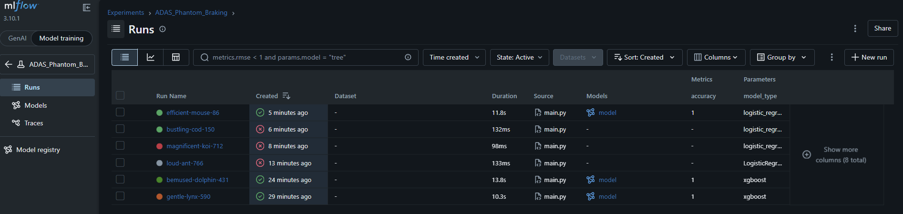
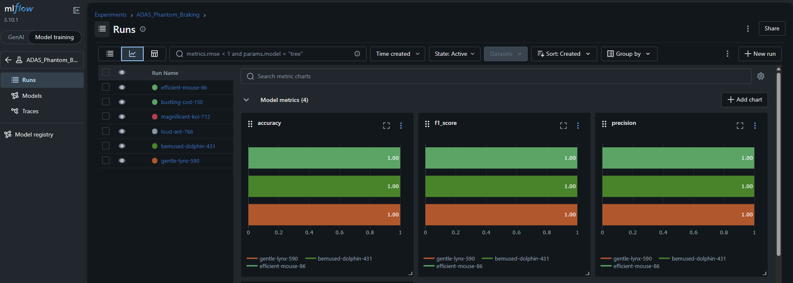

<div align="center">


# 🚗 ADAS Phantom Braking Detection
### MLOps Pipeline · Sensor Fusion Intelligence · Ghost Obstacle Classification

[](https://python.org)
[](https://xgboost.readthedocs.io)
[](https://scikit-learn.org)
[](https://mlflow.org)
[](https://dvc.org)
[]()
[]()

> **Developed by [Gravity AI · Phoenix Cyber Security]()**  
> *Intelligent Vehicle Safety · Autonomous Systems Division*

</div>

---

## Overview

A **production-grade MLOps pipeline** for detecting **phantom braking** in Advanced Driver Assistance Systems (ADAS) — where Automatic Emergency Braking (AEB) falsely triggers due to sensor noise, ghost radar targets, or environmental interference.

### Goals

| Objective | Description |
|-----------|-------------|
| 🎯 Ghost Detection | Classify false-positive obstacle detections from sensor fusion |
| 🛑 Reduce False AEB | Suppress unnecessary emergency braking events |
| 🔬 MLOps Practices | Reproducible, versioned, trackable experiments |

---

## Problem Statement

ADAS fuses inputs from three sensor types to make braking decisions:

```
┌─────────────┐    ┌─────────────┐    ┌─────────────┐
│    RADAR    │    │   CAMERA    │    │    LiDAR    │
│  Distance   │ +  │  Confidence │ +  │   Density   │  →  AEB Decision
│  Velocity   │    │  BBox Area  │    │   Points    │
└─────────────┘    └─────────────┘    └─────────────┘
         ↓
   ML Classifier
         ↓
   1 → Real Obstacle  (maintain AEB)
   0 → Phantom / Ghost  (suppress AEB)
```

**Ghost detection sources:** radar bridge reflections, camera shadow misclassifications, LiDAR vegetation/debris hits.

---

## Dataset

50,000 simulated sensor fusion samples with 18 features covering radar, camera, LiDAR, ego-vehicle state, and environmental conditions.

Key features: `radar_distance`, `relative_velocity`, `camera_confidence`, `lidar_density`, `sensor_agreement`, `time_to_collision`, `lane_overlap`, `rain_intensity`.

Target: `real_obstacle` — `1` = real obstacle, `0` = phantom/ghost.

---

## Project Structure

```
adas-phantom-braking-mlops/
├── configs/
│   └── config.yaml              # Pipeline config (mode, paths, hyperparams)
├── data/
│   └── raw/
│       └── adas_phantom_braking_dataset_50k.csv
├── docs/
│   └── images/
│       ├── Metrics_dashboard.png
│       └── MLFLOW_dashboard.png
├── logs/
│   └── pipeline.log             # Auto-generated runtime logs
├── models/
│   └── best_model.pkl           # Saved model artifact
├── src/
│   ├── data/preprocess.py
│   ├── models/
│   │   ├── train_model.py
│   │   ├── evaluate_model.py
│   │   └── predict_model.py
│   └── utils/logger.py
├── .dvc/                        # DVC configuration
├── mlruns/                      # MLflow experiment tracking
├── main.py
├── requirements.txt
└── README.md
```

---

## Installation

```bash
git clone <repo_url>
cd adas-phantom-braking-mlops
pip install -r requirements.txt
```

---

## Running the Pipeline

**Train:**
```yaml
# configs/config.yaml
mode: train
```
```bash
python main.py
```
Trains the selected model, evaluates on the test split, logs metrics to MLflow, and saves the artifact to `models/best_model.pkl`.

**Inference:**
```yaml
mode: test
```
```bash
python main.py
```
Loads the saved model and predicts using sensor parameters defined in `config.yaml`.

---

## Model Configuration

Swap models with zero code changes — all via `config.yaml`:

```yaml
model:
  selected_model: xgboost   # Options: random_forest | xgboost | logistic_regression

models:
  random_forest:
    n_estimators: 200
    max_depth: 10
  xgboost:
    n_estimators: 300
    max_depth: 6
    learning_rate: 0.1
  logistic_regression:
    max_iter: 200
```

---

## Experiment Tracking — MLflow

All training runs are tracked with **MLflow**: parameters, metrics, and model artifacts are logged automatically per run for full experiment traceability and comparison.

### MLflow Dashboard



> Tracks each run's hyperparameters, accuracy, F1-score, and model artifact path. Compare runs side-by-side to identify the best configuration.

### Metrics Dashboard



> Visual summary of model evaluation — accuracy, F1-score, and confusion matrix across trained models.

**Launch the MLflow UI:**
```bash
mlflow ui
# Open: http://localhost:5000
```

---

## Data Versioning — DVC

Dataset and model artifacts are versioned with **DVC**, decoupling large files from Git while maintaining full reproducibility.

```bash
# Track dataset
dvc add data/raw/adas_phantom_braking_dataset_50k.csv

# Push to remote storage
dvc push

# Reproduce pipeline
dvc repro
```

---

## MLOps Features

| Feature | Implementation |
|---------|----------------|
| Config-driven execution | `config.yaml` controls all pipeline behaviour |
| Experiment tracking | MLflow logs params, metrics, and artifacts per run |
| Data versioning | DVC tracks dataset and model artifact versions |
| Code versioning | Git for full source history |
| Reproducibility | Fixed `random_state` seed + DVC pipeline |
| Modular architecture | Independent preprocess / train / evaluate / predict modules |
| Centralized logging | Single logger injected across all modules → `logs/pipeline.log` |
| Model agnostic | Swap models via YAML with zero code changes |

---

## Logging

All runtime events are written to `logs/pipeline.log`: pipeline start, preprocessing stats, training params, evaluation metrics, model save path, predictions, and errors with tracebacks.

---

## 🔭 Roadmap

- [ ] **FastAPI service** — REST endpoint for real-time AEB inference
- [ ] **Docker deployment** — Containerized pipeline with `docker-compose`
- [ ] **CI/CD pipeline** — Automated retraining on new data ingestion
- [ ] **Real-time sensor simulation** — Streaming data via Kafka / MQTT
- [ ] **ADAS scenario dashboard** — Visual replay of detection decisions

---

<div align="center">

| | |
|---|---|
| **Organization** | Gravity AI · Phoenix Cyber Security |
| **Division** | Autonomous Systems & Intelligent Vehicle Safety |
| **Project** | ADAS Phantom Braking Detection — MLOps Pipeline |

**© 2024 Gravity AI · Phoenix Cyber Security. All rights reserved.**

*Building safer roads through intelligent sensing.*

</div>